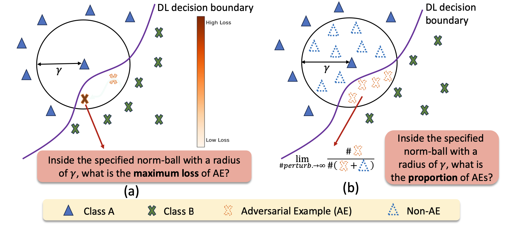

# PRBench: Probabilistic Robustness Benchmark

## Table of Contents

- [Introduction](#introduction)
- [Features](#features)
- [Tech Stack](#tech-stack) 
- [Demo](#demo)
- [Project Structure](#project-structure)
- [Usage](#usage)
- [Contributing](#contributing)

## Introduction

PRBench is a comprehensive web-based benchmark for evaluating probabilistic robustness (PR) and adversarial robustness (AR) of deep learning models across a range of training methods. It provides interactive leaderboards, performance tables, and visualizations to compare various methods on standardized datasets and perturbation settings.

## Features

- **Interactive Leaderboards**: Filter by dataset, model, and method.  
- **Performance Tables**: Metrics including clean accuracy, AR (PGD/C&W/Auto-Attack), PR, ProbAcc, generalization errors, and training time.  
- **Line Charts**: Dynamic PR, ProbAcc, and GEPR plots across perturbation radii.  
- **Composite Summary**: Aggregated robustness scores over all datasets and architectures.  
- **Responsive Design**: Mobile-friendly layout using Bootstrap and custom CSS.  
- **Static & Easy to Deploy**: Pure HTML/CSS/JS, no backend required.

## Tech Stack

- **HTML5** & **CSS3** (Bootstrap 5)  
- **JavaScript** (ES6+):  
  - [jQuery](https://jquery.com/)  
  - [DataTables](https://datatables.net/)  
  - [Chart.js](https://www.chartjs.org/) & [chartjs-plugin-zoom](https://github.com/chartjs/chartjs-plugin-zoom)

## Demo

🌐 Live demo:  
[Open PRBench Demo](https://kenneth939.github.io/Probabilistic-Robustness-for-Free-Revisiting-Its-Training-with-Benchmarking.github.io/)

https://kenneth939.github.io/Probabilistic-Robustness-for-Free-Revisiting-Its-Training-with-Benchmarking.github.io/

## Project Structure

    PRBench/
    ├── index.html
    ├── static/
    │   ├── css/
    │   │   └── style.css
    │   ├── js/
    │   │   ├── datatable-init.js
    │   │   ├── chart-init.js
    │   │   └── scroll.js
    │   └── src/
    │       ├── data/
    │       │   ├── prbench_table8.json
    │       │   └── prbench_table9.json
    │       └── images/
    │           ├── pic1.png
    │           ├── pic2.png
    │           ├── pic_loss_strategies.png
    │           └── pic_eval_metrics.png
    └── README.md

## Usage

**Leaderboard:**  
Scroll to the “Available Leaderboards” section, filter with the buttons, search globally.

**Performance Table:**  
Scroll further for detailed AR/PR metrics and composite robustness summary.

**Interactive Charts:**  
Under “Select Dataset & Model”, choose your dataset/model to update the three line charts.

## Contributing
We welcome contributions! You can:
- Open issues for bugs or feature requests.
- Submit pull requests for enhancements or fixes.
- Share new leaderboard data or chart configurations.

Please follow any existing CONTRIBUTING guidelines and adhere to our Code of Conduct if provided.
